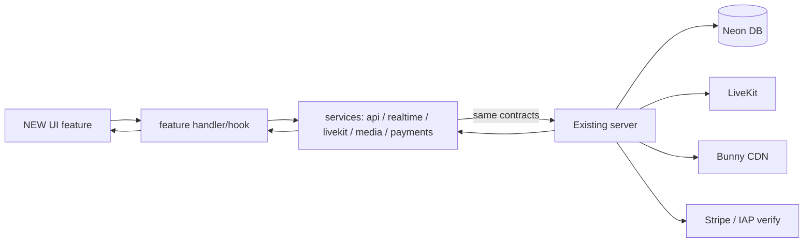

# Brand-New Elix Star Live Rebuild

New client + native code, same working backend. OLD is read-only reference only. Nothing copied from OLD source; Neon and server contracts preserved exactly.

## Locations
- NEW (all work): `C:\Users\Absm Construction\Desktop\Elix-Star-Live-New` (currently empty)
- OLD (read-only reference): `C:\Users\Absm Construction\Desktop\Elix Star Live`
- Production origin: `https://www.elixstarlive.co.uk`

## Foundation stack (locked)
- React 18 + TypeScript + Vite 6, Tailwind 3, zustand, react-router-dom 7, `livekit-client`, `zod`, framer-motion, lucide-react
- Capacitor 8 with brand-new Android + iOS projects, `appId com.elixstarlive.app`
- Native plugins matching product: `@capacitor/{app,preferences,push-notifications,share,clipboard}`, `@capgo/capacitor-social-login` (Apple), `@capgo/native-purchases` (IAP), CapacitorHttp
- Env resolution: `import.meta.env.VITE_* ?? window.__ENV.VITE_*` via `/env.js`; production fallback origin hardcoded like OLD

## Absolute guardrails
- Do NOT copy OLD components/hooks/stores/services/giant files/patches
- Do NOT edit OLD (0 modified files)
- Neon: no delete/reset/drop/truncate/destructive migration; NEW only speaks existing API/WS contracts
- Server: adapt NEW client to existing working contracts; never change server to cover a broken client without diffing URL/method/headers/auth/payload first
- IAP for in-app coins (`POST /api/verify-purchase`); Stripe only for shop (`POST /api/shop/checkout`); never mix
- No patch architecture — fix the owning layer (auth distinguishes 401 vs network; one shared gift idempotency; deterministic realtime lifecycle)

## Clean architecture
```
src/
  app/                     routing, shell, guards, error boundary, lifecycle
  config/                  env, feature flags, product constants
  components/              shared UI primitives (nav, sheets, avatars, gold/royce system)
  features/                auth, feed, video, profile, search, upload, comments,
                           chat, calls, notifications, live, battles, gifts,
                           wallet, payments, moderation, settings, admin, engagement, risingStars
  services/                api (zod transport), realtime (ws), livekit, media, storage, payments
  hooks/  types/  validation/  utils/  tests/
```
Rules: small focused modules, one API client, one WebSocket client, one LiveKit lifecycle, no giant screens, no duplicate logic.

## Server contracts NEW must speak (from OLD audit)
- Auth (Bearer JWT, `session.access_token`): `/api/auth/{login,register,me,logout,delete,resend-confirmation,verify-email,forgot-password,reset-password,apple/native}`
- Feed/videos: `/api/feed/{foryou,friends,track-view,track-interaction,score/:id}`, `/api/videos` (+ `:id/{like,unlike,save,unsave,comments,likes,fyp}`, `saved/list`, `liked/list`, `user/:id`)
- Profiles/social: `/api/profiles` (+ `:id`, `by-username/:u`, `:id/{followers,following,follow,unfollow}`), `/api/block-user`, `/api/unblock-user`, `/api/blocked-users`, `/api/report`, `/api/hearts/daily*`
- Media/upload: `POST /api/media/upload-file?path=&ct=` (raw binary) → `{cdnUrl}`, then `POST /api/videos` / `POST /api/stories`
- Live/LiveKit: `/api/live/{streams,start,end,token?room=&publish=0|1,moderation/check}`, `/api/live-share`
- Realtime: `wss://…/live/{roomId}?token=JWT`, frames `{event,data,timestamp}`; feed presence room `__feed__`; full send/receive event sets for chat, hearts, gifts, battles, cohost, engagement, moderation, calls
- Gifts/wallet/progression: `/api/gifts/{catalog,send}`, `/api/wallet/`, `/api/progression/me`
- Payments: coins IAP `POST /api/verify-purchase`; membership `/api/membership/iap-complete`; promote `/api/promote-iap-complete`; shop `POST /api/shop/checkout` (Stripe URL)
- Chat/calls/notifications: `/api/chat/threads*`, call signaling over WS + `call_*` LiveKit room, `/api/device-tokens`, `/api/notifications*`, `/api/activity`
- Also: engagement `/api/engagement/*`, rising-stars `/api/rising-stars/*`, creator `/api/creator/*`, admin `/api/admin/*`, music/sounds/camera-config, rankings, hashtags

## UI parity target (locked)
Reproduce exactly: gold theme tokens (`--color-primary #D4AF37`, gold-bright, royce glow/tile icon system), CSS vars (`--nav-height`, safe-area, feed 480px column, z-index layers), Inter/Roboto font stack, bottom nav (Home/Friends/Create/Inbox/Profile), top nav on `/feed` (LIVE/STEM/Explore/Following/Shop/For You/Search), all modals/overlays (comments, likes, share, gift panel, buy coins, gift/battle overlays, ranking, incoming call, live-notify banner). Exclude proven-dead: `/purchase-coins` route, `ForYouStoriesStrip`, `LiveAIFilters`.

## Model / agent strategy (auto-select, no per-switch prompts)
- Lead/orchestrator: this agent — owns directive, architecture, parity tracker, integration
- Main builder: `gpt-5.3-codex` — screens, modules, API/WS wiring, tests, Android/Capacitor, debugging
- Hard architecture / high-risk: `claude-opus-5-thinking-high` — auth lifecycle, realtime/LiveKit lifecycle, gifts/transactions, battles, IAP, security, race conditions, reviews
- Large-context audit: `gemini-3.1-pro` (largest available context; "Gemini 1M" has no exact slug) — OLD-vs-NEW parity, API/WS inventory, dead-code, missed behaviour (analyze/report only)
- Mechanical: `claude-4.6-sonnet-medium-thinking` — simple components, repetitive screens, low-risk wiring, test expansion
- Multi-agent safety: separate git worktrees/branches, isolated feature ownership, no overlapping files, lead reviews + tests before merge, one coherent architecture

## Data flow


## Build order (dependency-first)
1. Scaffold + config + env + git init
2. Design tokens + shared UI primitives (exact OLD look)
3. Services: API (zod) + realtime + livekit + media + storage + payments transport
4. Auth/session (explicit hydrate → local publish → server revalidate → distinguish auth-fail vs network)
5. Routing/guards/error boundary/app lifecycle/deep links
6. Profiles + social
7. Video/media layer + feeds + comments/likes/follows
8. Search/discover/hashtag/rising-stars/music
9. Upload/create (Bunny → register)
10. Chat + calls + notifications
11. Live foundation → host → spectator (modular, not one giant file)
12. Gifts + battles + cohost + goals/leaderboard + moderation + engagement
13. Wallet/coins + creator earnings/payouts + Stripe shop + IAP verify
14. Native Android (permissions, push, deep links, LiveKit, IAP, signing, AAB)
15. Native iOS (entitlements, APNS, Apple Sign-In) — external Apple/macOS steps documented as BLOCKED
16. Final: Gemini parity audit, E2E verification, security + dead-code audit, production builds, PARITY tracker

## Verification & parity
- Per feature loop: inspect OLD UI/behaviour → trace server contract → implement new → connect → test → compare OLD vs NEW → mark PASS/FAIL/BLOCKED in `docs/PARITY.md`
- Baseline after each group: relevant tests, full vitest, `tsc` typecheck, production build; Android AAB at native stage
- Meaningful regression tests only (auth hydration, network≠logout, WS reconnect/cleanup, room switching, gift dedupe, battle state, upload failure, wallet, IAP result, guards)
- PASS = real functional + visual parity, not route existence or green build
- Status stays NEW CLEAN REBUILD — IN PROGRESS until all non-blocked items PASS; only genuine external blockers (Apple Sign-In config, iOS archive/signing on macOS, on-device IAP sheet) may remain BLOCKED

## Continuous execution
Run the loop build → connect → test → verify → parity → next without stopping for re-approval; select the model per stage automatically; keep one coherent architecture.