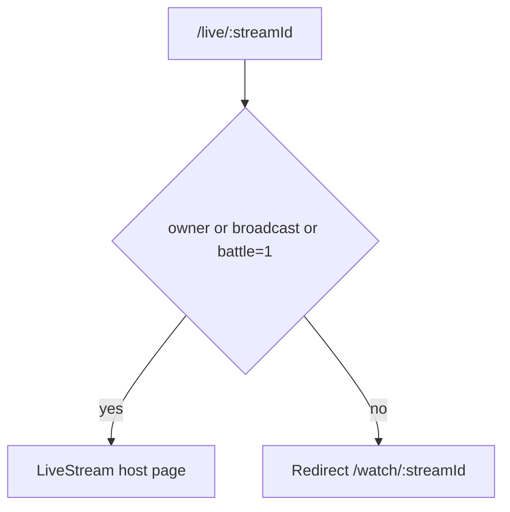

# 01 — Screens, Routes and Navigation

Source of truth: [`src/App.tsx`](../src/App.tsx) at commit `013c722`.
Method: read directly from the `<Routes>` block, lines 390–495. No assumptions.

## Router shape

React Router v6 with `lazyWithRetry` code splitting ([`src/lib/lazyWithRetry.ts`](../src/lib/lazyWithRetry.ts)).

Three access tiers:

1. **Public** — no auth
2. **`RequireAuth`** wrapper ([`src/components/RequireAuth.tsx`](../src/components/RequireAuth.tsx))
3. **`RequireAdmin`** nested inside RequireAuth ([`src/components/RequireAdmin.tsx`](../src/components/RequireAdmin.tsx))

Auth gate is enforced twice: once by a top-level redirect in `App.tsx` (lines 348–350) using an `isPublicRoute` allowlist, and once by the `RequireAuth` route element. Both must be preserved.

## Route table (77 paths)

### Public (17)

| Path | Component | File |
|------|-----------|------|
| `/` | Navigate → `/feed` or `/login` | inline, `App.tsx:391` |
| `/login` | `Login` | `src/pages/Login.tsx` |
| `/register` | `Register` | `src/pages/Register.tsx` |
| `/auth/callback` | `AuthCallback` | `src/pages/AuthCallback.tsx` |
| `/terms` | `Terms` | `src/pages/Terms.tsx` |
| `/privacy` | `Privacy` | `src/pages/Privacy.tsx` |
| `/copyright` | `Copyright` | `src/pages/Copyright.tsx` |
| `/legal` | `Legal` | `src/pages/Legal.tsx` |
| `/legal/audio` | `LegalAudio` | `src/pages/LegalAudio.tsx` |
| `/legal/ugc` | `LegalUGC` | `src/pages/LegalUGC.tsx` |
| `/legal/affiliate` | `LegalAffiliate` | `src/pages/LegalAffiliate.tsx` |
| `/legal/dmca` | `LegalDMCA` | `src/pages/LegalDMCA.tsx` |
| `/legal/safety` | `LegalSafety` | `src/pages/LegalSafety.tsx` |
| `/legal/supplier` | `LegalSupplier` | `src/pages/LegalSupplier.tsx` |
| `/guidelines` | `Guidelines` | `src/pages/Guidelines.tsx` |
| `/how-it-works` | `HowItWorks` | `src/pages/HowItWorks.tsx` |
| `/support` | `Support` | `src/pages/Support.tsx` |
| `/forgot-password` | `ForgotPassword` | `src/pages/ForgotPassword.tsx` |
| `/reset-password` | `ResetPassword` | `src/pages/ResetPassword.tsx` |

### Authenticated — feeds and discovery

| Path | Component |
|------|-----------|
| `/feed` | `VideoFeed` |
| `/stem` | `StemFeed` |
| `/following` | `FollowingFeed` |
| `/friends` | `FriendsFeed` |
| `/search` | `SearchPage` |
| `/discover` | `Discover` |
| `/hashtag/:tag` | `Hashtag` |
| `/music`, `/music/:songId` | `MusicFeed` |
| `/saved` | `SavedVideos` |
| `/video/:videoId` | `VideoView` |

### Authenticated — live

| Path | Component | Notes |
|------|-----------|-------|
| `/live` | `LiveDiscover` | |
| `/live/:streamId` | `LiveStreamGuard` | **Role router** — see below |
| `/live/start` | Navigate → `/live` | |
| `/live/broadcast` | `LiveStreamKeyed` | host broadcast |
| `/live/watch/:streamId` | `LiveWatchRedirect` | legacy → `/watch/:streamId` |
| `/watch/:streamId` | `SpectatorPageKeyed` | spectator |

### Authenticated — engagement

`/engagement`, `/engagement/missions`, `/engagement/fan-level`, `/engagement/mvp`, `/engagement/achievements`, `/engagement/rewards`, `/engagement/daily-login`, `/engagement/collections` → `src/pages/engagement/*`

### Authenticated — profile, social, settings

| Path | Component |
|------|-----------|
| `/profile`, `/profile/:userId` | `Profile` |
| `/profile/:userId/followers` | `FollowList` |
| `/profile/:userId/following` | `FollowList` |
| `/edit-profile` | `EditProfile` |
| `/inbox` | `Inbox` |
| `/inbox/:threadId` | `ChatThread` |
| `/settings` | `Settings` |
| `/settings/payout` | `CreatorPayout` |
| `/settings/blocked` | `BlockedAccounts` |
| `/settings/safety` | `SafetyCenter` |
| `/settings/security` | `SecuritySettings` |
| `/settings/notifications` | `NotificationSettings` |
| `/creator/login-details` | `CreatorLoginDetails` |

### Authenticated — create, commerce, misc

| Path | Component |
|------|-----------|
| `/create` | `Create` |
| `/upload` | `Upload` |
| `/purchase-coins` | `PurchaseCoins` |
| `/shop`, `/shop/:itemId` | `Shop` |
| `/call` | `VideoCall` |
| `/ai-studio` | `AIStudio` |
| `/report` | `Report` |
| `/rising-stars` | `RisingStars` |
| `/rising-stars/challenge/:challengeId` | `RisingStarsChallenge` |

### Admin (8, under `RequireAdmin`)

`/admin`, `/admin/users`, `/admin/reports`, `/admin/economy`, `/admin/purchases`, `/admin/withdrawals`, `/admin/rising-stars`, `/admin/progression` → `src/pages/admin/*`

### Fallback

`*` → Navigate to `/feed` (`App.tsx:494`)

## Critical routing logic that must be preserved exactly

### 1. `LiveStreamGuard` — host vs spectator role split

`App.tsx:114-137`. Redirects `/live/:id` to `/watch/:id` unless the visitor is the stream owner, `broadcast`/`start`/`watch` literal, or an explicit battle joiner (`?battle=1`).

Comment in source states the battle-creator role is **server-authorized**; the client guard is convenience only. The server issues a LiveKit publish token only against a real battle grant. This security property must survive the rebuild.

### 2. Remount keys

- `LiveStreamKeyed` keys on `pathname + search` (`App.tsx:102-105`)
- `SpectatorPageKeyed` keys on `pathname` (`App.tsx:109-112`)

Reason documented in source: full remount per stream so battle redirects (`/watch/B` → `/watch/A`) never carry stale WebSocket/LiveKit/battle state between rooms. This is a correctness requirement, not a patch.

### 3. Chrome visibility rules (`App.tsx:296-320`)

| Flag | Paths |
|------|-------|
| `isFeedWithTopBar` | `/`, `/feed` |
| `isFeedNoTopBar` | `/stem`, `/following`, `/friends` |
| `isFullScreen` | feeds + `/video/*` |
| `isNavHidden` | `/live`, `/live/*`, `/watch/*`, `/create*`, `/upload`, `/login`, `/register` |
| `showBottomNav` | authenticated AND not nav-hidden |

Padding classes applied on `<main>` (`App.tsx:378-387`) are **layout-critical** and locked.

### 4. App-level lifecycle effects

| Effect | Location | Purpose |
|--------|----------|---------|
| Auth hydration gate | `App.tsx:182-192` | waits for persisted session before `/api/auth/me`; comment records the bug this prevents (token-less checkUser wiping saved login) |
| 3s loading failsafe | `App.tsx:195-200` | forces `isLoading:false` if auth hangs |
| Analytics / push / IAP init | `App.tsx:202-213` | each individually guarded so none can crash boot |
| Per-user init | `App.tsx:218-267` | analytics user id, push token register, IAP reconcile, incoming calls, `force_disconnect`/`user_banned` handlers |
| Presence socket | `App.tsx:237-256` | keeps `__feed__` WS room alive off live surfaces, 5s interval |
| Foreground resume | `App.tsx:269-290` | WS reconnect, session refresh, IAP reconcile |
| Edge swipe back | `App.tsx:163-175`, `366-375` | 24px left edge, 60px threshold |

## Global chrome components

Always mounted in `App.tsx` render: `OfflineBanner`, `IncomingCallModal`, `LiveNotifyBanner`, `TopNav`, conditional `BottomNav`, `ErrorBoundary` + `Suspense` around `Routes`.

## Page file count

69 `.tsx` files under `src/pages` (48 top-level, 8 admin, 9 engagement incl. `EngagementShell`, 4 settings).

`EngagementShell.tsx` is a shared layout used by engagement pages, not a route target.
