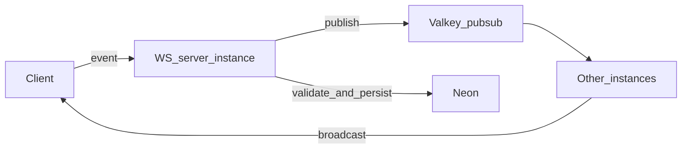

# 04 — WebSocket Protocol

Sources: [`server/websocket/handlers.ts`](../server/websocket/handlers.ts), [`server/websocket/index.ts`](../server/websocket/index.ts), [`src/lib/websocket.ts`](../src/lib/websocket.ts), `_audit/ws_*.txt` at commit `013c722`.

Transport: WebSocket with Valkey pub/sub fan-out across server instances (`attachWebSocket` in `server/websocket/index.ts`, `server/lib/valkey.ts`).

## Inbound events — client → server (36)

Server accepts 36 event types. Client sends 35 of them.

| Domain | Events |
|--------|--------|
| Core live | `chat_message`, `heart_sent`, `gift_sent`, `stream_start`, `stream_end`, `ping` |
| Battle | `battle_create`, `battle_join`, `battle_end`, `battle_get_state`, `battle_gift_score`, `battle_spectator_vote`, `battle_invite_send`, `battle_invite_accept`, `battle_invite_decline` |
| Co-host | `cohost_invite_send`, `cohost_invite_accept`, `cohost_request_send`, `cohost_request_accept`, `cohost_request_decline`, `cohost_layout_sync` |
| Engagement | `engagement_get_state`, `engagement_watch_tick`, `engagement_mystery_start`, `engagement_poll_set`, `engagement_poll_end`, `engagement_poll_vote`, `engagement_features_set` |
| Goals / boost | `gift_goal_set`, `gift_goal_clear`, `booster_activated`, `mist_activated` |
| Calls | `call_invite`, `call_accepted`, `call_rejected`, `call_ended` |

### The one asymmetry

`battle_gift_score` is accepted by the server but **never sent by the client**.

Verified: present in [`_audit/ws_server_events.txt`](../_audit/ws_server_events.txt), absent from [`_audit/ws_client_sends.txt`](../_audit/ws_client_sends.txt).

Prior audit classified this as intentional — battle scoring is server-authoritative and derived from verified gift transactions, not from a client-declared score. **Accepting a client-supplied battle score would be a trust violation.** In the rebuild this handler should either stay server-internal or be removed, never wired to the client.

## Outbound events — server → client (50)

Client listens for 50 event names ([`_audit/ws_client_listens.txt`](../_audit/ws_client_listens.txt)). Note this file also contains 5 Capacitor/Vite listener names that are not WebSocket events and should be ignored: `appStateChange`, `appUrlOpen`, `backButton`, `registration`, `registrationError`.

| Domain | Events |
|--------|--------|
| Connection | `connected`, `room_state`, `user_joined`, `user_left`, `force_disconnect`, `user_banned` |
| Chat / gifts | `chat_message`, `gift_sent`, `heart_sent`, `gift_goal_sync` |
| Battle | `battle`, `battle_state_sync`, `battle_score`, `battle_tick`, `battle_countdown`, `battle_ended`, `battle_error`, `battle_ready_state`, `battle_invite`, `battle_invite_ack`, `battle_invite_accepted`, `battle_invite_declined`, `battle_accept_ack` |
| Co-host | `cohost_invite`, `cohost_invite_ack`, `cohost_invite_accepted`, `cohost_request`, `cohost_request_accepted`, `cohost_request_declined`, `cohost_layout_sync` |
| Engagement | `engagement_sync`, `engagement_milestone`, `engagement_stage_unlock` |
| Booster | `booster_activated`, `booster_caught`, `mist_activated` |
| Moderation | `moderation_warning`, `moderation_pause`, `moderation_suspend` |
| Stream | `stream_ended` |
| Calls | `call_invite`, `call_accepted`, `call_rejected`, `call_ended` |

## Connection lifecycle

### Presence socket (App-level)

`src/App.tsx:237-256`. When authenticated and **not** on a live surface (`/live/*`, `/watch/*`, `/live/broadcast`, `/call`), the app maintains a persistent connection to the pseudo-room `__feed__`:

```js
websocket.connect("__feed__", token, { persistent: true });
```

Re-checked every 5 seconds. Purpose per source comment: keep `call_invite` / `force_disconnect` and other user-global events working while browsing.

Live pages **take over the singleton** when the user joins a real room. The websocket client is a singleton — this handoff is load-bearing and easy to break in a rebuild.

### Foreground reconnect

`src/App.tsx:269-290` calls `websocket.reconnectOnForeground()` on `visibilitychange`, alongside a session refresh and IAP reconcile.

### Global auth events

`force_disconnect` and `user_banned` both trigger `signOut()` (`src/App.tsx:228-232`).

## Room model



Multi-instance fan-out via Valkey means any rebuild must keep publishing through the same channel structure, or live rooms silently split across instances.

## Gift delivery: dual path

Gifts reach viewers through **two independent paths**, deliberately:

1. **REST** — `POST /api/gifts/send` validates, debits the wallet, records the transaction, and the server broadcasts to the room (`server/routes/gifts.ts`).
2. **WebSocket** — `gift_sent` event.

`server/websocket/handlers.ts:317` carries a comment describing coordination with REST `/api/gifts/send` "so the creator still sees the gift even if" the other path is delayed.

The client also has a **third, local** echo: `pushLocalGiftPill()` in [`src/components/GiftAnimationOverlay.tsx`](../src/components/GiftAnimationOverlay.tsx), dispatched immediately after a successful local send so the sender's own UI does not wait for the WS round trip.

De-duplication is by `transaction_id`, tracked in:

- `GiftAnimationOverlay` — `seenTxnRef` (200-entry cap, trimmed to 100)
- `LiveStream.tsx` — `playedGiftVideoTxnRef` (same capping pattern)

This triple-path design is **not** a patch. It is the reason gifts appear instantly for the sender, reliably for viewers, and exactly once for everyone. Any rebuild must reproduce all three paths plus the txn de-dup, or gifts will either lag or double-play.

## Runtime caps

[`src/lib/liveRuntimeCaps.ts`](../src/lib/liveRuntimeCaps.ts) defines `LIVE_CHAT_MESSAGE_CAP` and `LIVE_GIFT_QUEUE_CAP`, applied via `appendCapped()` on every inbound chat message and queued gift. This bounds memory in long streams. It is the only client module with a unit test.
