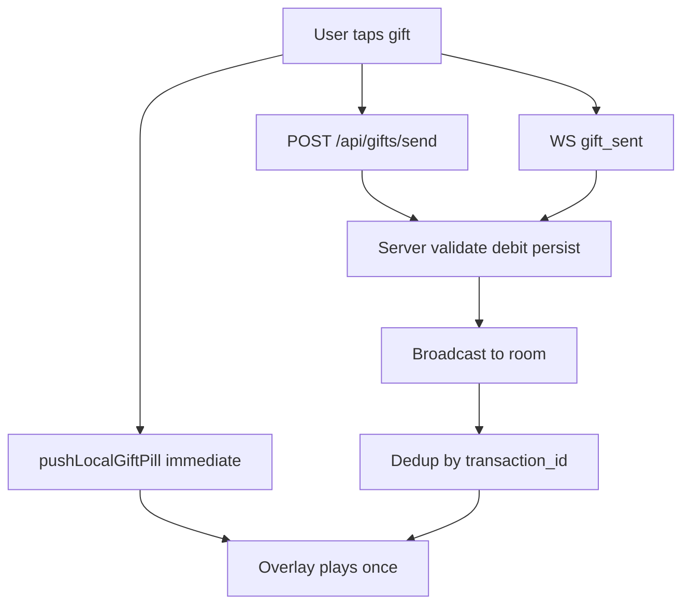

# 07 — End-to-End Feature Traces

Every claim below is read from source at commit `013c722`, with file and line references. Trace shape:

```text
UI → handler → lib → API/WS → server → DB/provider → response/event → UI
```

---

## 1. Authentication

### Email login

| Step | Location |
|------|----------|
| UI | `src/pages/Login.tsx` |
| Store action | `useAuthStore.signIn` — `src/store/useAuthStore.ts:239` |
| Request | `POST /api/auth/login` via `request()` in `src/lib/apiClient.ts` |
| Server | `server/routes/auth.router.ts` → `auth.ts` |
| DB | `elix_auth_users`, `elix_auth_sessions` (Neon) |
| Response | `{ user, accessToken }` normalized by `src/lib/authApiContract.ts` |
| Persist | `session: { user, access_token }` — `useAuthStore.ts:297` |
| Storage | Capacitor `Preferences` via custom `StateStorage` — `useAuthStore.ts:80-114` |

### Registration

`src/pages/Register.tsx` → `POST /api/auth/register` (`useAuthStore.ts:325`) → on success also `POST /api/profiles` (`:385`) to create the profile row → session stored (`:402`).

### Apple Sign-In (native)

`@capgo/capacitor-social-login` dynamically imported (`useAuthStore.ts:440`) → `SocialLogin.initialize` → `SocialLogin.login` (`:449`) → `POST /api/auth/apple/native` (`:461`) → session (`:485`).

Dynamic import matters: the plugin is only loaded when Apple sign-in is actually used, so web builds don't pay for it.

### Session restore — the important part

`src/App.tsx:182-192` waits for Zustand persist hydration **before** calling `checkUser()`:

```ts
if (useAuthStore.persist.hasHydrated()) runCheckUser();
else return useAuthStore.persist.onFinishHydration(runCheckUser);
```

The source comment records the bug this prevents: running `checkUser` before hydration used no token, cleared state, and could overwrite a saved login. **This is a fix, not a patch. It must be reproduced.**

### Failure handling in `checkUser` (`useAuthStore.ts:534-592`)

Distinguishes two cases deliberately:

- **Auth failure** (401 / no token) → clears session
- **Transient network error with a persisted session** (`:590-592`) → does **not** log the user out

Any rebuild that collapses these two branches will log users out on every network blip.

### Sign out

`POST /api/auth/logout` wrapped in try/catch that intentionally swallows errors (`:502`) — local session clearing must succeed even if the server call fails. Also triggered globally by WS `force_disconnect` / `user_banned` (`App.tsx:228-232`).

---

## 2. Gift send — the most safety-critical client path

### Client

`GiftPanel` (in `LiveStream.tsx` / `SpectatorPage.tsx`) → generates a client `transaction_id` → `POST /api/gifts/send`.

### Server — `server/routes/gifts.ts:42` `handleSendGift`

1. **Requires `transaction_id`** — 400 if missing (`:93-97`), truncated to 128 chars
2. Selects currency source in priority order: **starter coins** → **promotional coins** → **real wallet**
3. Idempotency at every layer:
   - promo retry guarded by `WHERE client_transaction_id = $1` (`:239`)
   - `INSERT INTO elix_gift_transactions ... ON CONFLICT (client_transaction_id) DO NOTHING` (`:289`, `:444`)
4. Real-coin path: `neonDebitGiftWithCreatorCredit` — atomic debit of sender + credit of creator (`server/lib/walletNeon.ts`)
5. Returns authoritative `new_balance` / `new_starter_balance` / `new_promotional_balance`

The client never computes a balance. The server returns it. That property is non-negotiable.

### Delivery — three paths, by design



| Path | Purpose | Evidence |
|------|---------|----------|
| Local echo | sender sees own gift instantly | `pushLocalGiftPill()` in `src/components/GiftAnimationOverlay.tsx` |
| REST broadcast | reliable server-authoritative delivery | `server/routes/gifts.ts:3` header comment |
| WS `gift_sent` | low-latency delivery | `server/websocket/handlers.ts:317` comment on REST coordination |

De-duplication by `transaction_id`: `seenTxnRef` in `GiftAnimationOverlay` (200 cap, trim to 100) and `playedGiftVideoTxnRef` in `LiveStream.tsx`.

### Video resolution

`pickGiftVideoUrl(data, catalog)` in [`src/lib/giftsCatalog.ts`](../src/lib/giftsCatalog.ts), with a catalog-refetch retry when the gift id is not yet in the local catalog. Both `LiveStream.tsx` and `SpectatorPage.tsx` now use the identical resolve path (aligned at commit `013c722`).

`preferPlayableGiftVideoUrl` selects an Android-playable variant. Assets served from Bunny CDN `https://elixstorage.b-cdn.net`; `server/index.ts:451-457` redirects `/gifts/*` to the CDN.

### Overlay rendering

`GiftOverlay` renders fixed to the bottom, `height: calc(70% - 25mm)`, max width 480px, with a `linear-gradient(to top, black 0%, black 60%, transparent 100%)` mask, default `zIndex 50000` (spectator passes lower so combo icons stay on top).

**These exact values are the owner-approved visual result and are frozen.**

---

## 3. Coin purchase (IAP) — Android and iOS

| Step | Location |
|------|----------|
| UI | `src/pages/PurchaseCoins.tsx`, `src/components/BuyCoinsModal.tsx` |
| Client lib | `src/lib/iap.ts` — `@capgo/native-purchases` (StoreKit 2 / Play Billing) |
| Product IDs | `IAP_PRODUCTS` (`iap.ts:11`), must match App Store Connect / Play Console |
| Purchase | `NativePurchases.purchaseProduct` |
| Verify | `POST /api/verify-purchase` |
| Server | `handleVerifyPurchase` — `server/routes/misc.ts:322` |
| Google | `verifyGooglePlayPurchase` (`misc.ts:207`) via `server/lib/googlePlaySubscriptions.ts` |
| Apple | `server/lib/appleIap.ts` |
| Credit | `neonCreditIap` (`misc.ts:419`) → `elix_wallet_balances` + `elix_wallet_ledger` |
| Response | `{ success, newBalance }` (`misc.ts:435`) |

### Safety properties (all `KEEP BEHAVIOUR`)

| Property | Evidence |
|----------|----------|
| Coins credited **only** after server-side receipt verification | `misc.ts:389` — "IAP verification failed - coins NOT credited" |
| Replay-safe — already-credited transactions return the authoritative balance without re-crediting | `misc.ts:356`, `:439-443` |
| Refunded/revoked consumables must not credit | `misc.ts:307` comment |
| Server fails to boot without `GOOGLE_SERVICE_ACCOUNT_JSON` | `server/lib/envValidate.ts:31-34` |
| Stuck "already owned" purchases reconciled, not faked | `reconcileOwnedCoinPurchases()` — `App.tsx:222` (login) and `:280` (foreground) |
| `restoredOwned` flag distinguishes reconciliation from a fresh purchase | `iap.ts:71` |
| Diagnostics never block a purchase | `iap.ts:99` — "diagnostics must never break a purchase" |

Stripe is **not** in this path. Shop checkout uses `POST /api/shop/checkout` → `server/routes/checkout.ts` → Stripe, with the webhook mounted raw-body before JSON parsing.

---

## 4. Live streaming

### Start (host)

`src/pages/LiveStream.tsx` → `POST /api/live/start` (`server/routes/live.router.ts:8`, validated by `liveStartSchema`) → row in `live_streams` → `GET /api/live/token?publish=1` → LiveKit room connect → WS `stream_start`.

### Token authorization — `server/routes/livestream.ts:471-543`

This is the core live security control:

```ts
// Publishing must be server-authorized: only the host or a host-approved
// co-host may receive a publish token. Never trust a client "publish" flag alone.
```

| Requester | Result |
|-----------|--------|
| Host of the room | publish token |
| Battle participant with `hasBattlePublishGrant(room, userId)` (`:487`) | publish token |
| Co-host with `hasCohostPublishGrant(room, userId)` (`:488`) | publish token |
| `call_*` room, authenticated | publish token — mutual 1:1 (`:472-482`) |
| Anyone else requesting publish | **403** (`:504`) |
| Viewer | subscribe-only token, `canPublish: false` (`:543`) |

The client-side `LiveStreamGuard` in `App.tsx` is convenience routing only. **The server is the authority.** A rebuild must not move any part of this decision to the client.

### Watch (spectator)

`/watch/:streamId` → `SpectatorPageKeyed` (full remount per stream) → `GET /api/live/token` (no publish) → LiveKit subscribe → WS join → receives `room_state`, `user_joined`, `chat_message`, `gift_sent`, `battle_*`.

### Ghost-stream prevention

`livestream.ts:254-264`: a stream is only listed if `roomHasActivePublisher(key)` or `isUserPublishingInRoom(key, s.user_id)`. Comment: "still require a publisher so ghost cards do not return." Reproduce this or dead streams reappear in discovery.

### End

`POST /api/live/end` + WS `stream_end` → viewers receive `stream_ended`. LiveKit webhook (`server/routes/livekit-webhook.ts`) provides server-side reconciliation when a room dies without a clean client end.

---

## 5. Video upload

Documented in `src/lib/videoUpload.ts:2-3`:

```text
validate → upload binary/thumbnail via /api/media/upload-file → POST /api/videos → FYP boost
```

| Step | Location |
|------|----------|
| UI | `src/pages/Upload.tsx`, `src/pages/Create.tsx` |
| Validation | synchronous, `videoUpload.ts:53` — "no async IO so the upload never blocks on this step" |
| Auth guard | `:100` — "You must be logged in to upload." |
| Storage path | `videos/${userId}/${videoId}/original.${ext}` (`:114`) |
| Binary upload | `bunnyUpload()` → `POST /api/media/upload-file` (`server/routes/media.router.ts:38`, rate-limited by `uploadLimiter`) |
| Provider | `uploadToBunny()` — `server/services/bunny.ts` |
| Thumbnail | `generateAndUploadThumbnail` (`:130`), non-critical — failure still allows the video (`:136`) |
| Record | `POST /api/videos` (`:156`) → `videos` table |
| FYP | `POST /api/videos/:id/fyp` (`:172`) |
| Progress | `UploadProgress` stages: validating, compressing, uploading, processing, complete (`:12`) |
| Analytics | `video_upload` / `video_upload_failed` (`:182`, `:190`) |

Bunny not configured → `503` with an explicit config error (`media.router.ts:43`, `upload.ts:41`). No fake success. Avatar upload additionally falls back to a generated avatar so the app still works (`upload.ts:118-119`).

Stories use the same Bunny path but write to `/api/stories` (`videoUpload.ts:196`).

---

## 6. Chat (DM)

`src/pages/Inbox.tsx` → `GET /api/chat/threads` → `src/pages/ChatThread.tsx` → `GET /api/chat/threads/:threadId/messages` → send via `POST /api/chat/threads/:threadId/messages` → `messages` table → read receipt `POST /api/chat/threads/:threadId/read`.

Thread creation: `POST /api/chat/threads/ensure` (used by `src/lib/openDmThread.ts`).

Live chat is separate: WS `chat_message` in/out, capped by `LIVE_CHAT_MESSAGE_CAP`.

---

## 7. Notifications

Register: `src/lib/notifications.ts` → `@capacitor/push-notifications` → `registration` event → `POST /api/device-tokens` → `elix_device_tokens`.
Called from `App.tsx:221` on user login.

Send: `server/lib/push.ts` → FCM using `GOOGLE_SERVICE_ACCOUNT_JSON` / FCM service account.
In-app list: `GET /api/notifications`, mark read `POST /api/notifications/read`, table `elix_notifications`.

**APNS is not configured.** iOS push is not fully wired. Recorded, not fixed.

---

## 8. Feed

`src/pages/VideoFeed.tsx` → `GET /api/feed/foryou` (Valkey-cached via `server/lib/feedCacheValkey.ts`) → `EnhancedVideoPlayer`.

Interactions: `POST /api/feed/track-view`, `POST /api/feed/track-interaction`, `POST /api/videos/:id/like|unlike|save|unsave`, comments under `/api/videos/:id/comments`.
Scoring: `video_scores`, `GET /api/feed/score/:videoId`.
Variants: `/api/feed/friends`, `/api/videos/user/:userId`, `/api/videos/liked/list`, `/api/videos/saved/list`.

---

## 9. Calls

Invite: WS `call_invite` → recipient's presence socket on `__feed__` → `IncomingCallModal` (mounted globally in `App.tsx`) → accept sends `call_accepted` → both navigate to `/call` → `GET /api/live/token` for room `call_<uuid>` → both get publish tokens (`livestream.ts:472-482`).

Subscription: `subscribeToIncomingCalls(user.id)` — `App.tsx:226`.

This is exactly why the `__feed__` presence socket exists. Remove it and incoming calls stop working while browsing.

---

## Cross-cutting patterns worth preserving

| Pattern | Where | Why |
|---------|-------|-----|
| Server returns authoritative balances | gifts, IAP, wallet | client never computes money |
| Idempotency keys on all money writes | `client_transaction_id` | retries cannot double-charge |
| Fail-closed on missing credentials | `envValidate.ts` | never charge while verification is broken |
| Fail-visible on provider outage | `503` from Bunny routes | no fake upload success |
| Capped in-memory collections | `liveRuntimeCaps.ts` | bounded memory in long streams |
| Guarded init | `App.tsx:202-213` | one broken subsystem cannot block boot |
| Full remount per live room | `App.tsx:102-112` | no stale WS/LiveKit state across rooms |
| Dynamic import of heavy native plugins | SocialLogin, NativePurchases | boot cost |

Every one of these is a correct engineering decision, not accumulated debt. The rebuild's job is to keep all of them while removing duplication.
