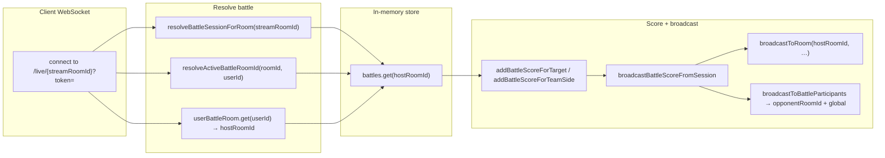

# PK / battle: server flow (single source of truth)

Canonical battle storage: **`battles: Map<string, BattleSession>`** keyed only by **`session.hostRoomId`** (host stream room id).  
See the **IMPORTANT** comment above `battles` in `server/index.ts`.

---

## Diagram (high level)



---

## Pseudocode (matches implementation)

```text
// 1) Where is the battle row?
hostKey = session.hostRoomId   // ONLY key used in `battles` Map

// 2) Opponent / spectator connects with roomId = opponent stream
session = resolveBattleSessionForRoom(client.roomId)
//    → direct get, or walk sessions where hostRoomId === roomId OR opponentRoomId === roomId

// 3) Opponent must join the host-keyed battle (fixed bug: never joinBattle(client.roomId) alone)
joinBattle(session.hostRoomId, opponentUserId, …)

// 4) After any score mutation
broadcastBattleScoreFromSession(session, hostKey, target, points)
  → broadcastToRoom(hostKey, "battle_score", payload)
  → broadcastToBattleParticipants(hostKey, session, …)
        → broadcastToRoom(opponentRoomId, …) if set and ≠ hostKey
        → sendToUserGlobal(participantUserId, …) if not in reached rooms

// 5) Periodic snapshot (~300ms ACTIVE)
payload = buildBattleScoreUpdatePayload(session)   // teamA = A1+A2, teamB = B1+B2
broadcastToRoom(hostKey, "battle:score_update", payload)
broadcastToBattleParticipants(hostKey, session, "battle:score_update", payload)
```

---

## Gift path (`gift_sent`)

1. **`battleRoomId`** resolution (same battle, host key):

   - Start with `client.roomId`; if not in `battles`, try `userBattleRoom.get(client.userId)`, else find session where `opponentRoomId === client.roomId`.

2. **`normalizedTarget`** (which bucket gets points): `battleTarget` → else participant role → else **room match** (`client.roomId === opponentRoomId` → opponent, `=== hostRoomId` → host).

3. **`addBattleScoreForTarget(battleRoomId, normalizedTarget, value)`** — `battleRoomId` must be **host** key.

---

## UI vs server colors

| Bar side | Server buckets |
|----------|----------------|
| Red (team A) | `hostScore + player3Score` (A1 + A2) |
| Blue (team B) | `opponentScore + player4Score` (B1 + B2) |

If **red = 0** and **blue = large**, the server may be **correct** if all gifts/taps targeted **team B** only. Mis-sync is more likely when **UPDATE AFTER** shows both A and B moving but **one** client’s UI stays wrong — then check WebSocket delivery (`DEPLOY-WS.md`) and **`opponentRoomId`** on the session.

---

## Related

- `DEPLOY-WS.md` — `wss://` / Coolify / Traefik  
- `server/index.ts` — `resolveBattleSessionForRoom`, `broadcastToBattleParticipants`, `case "gift_sent"`
